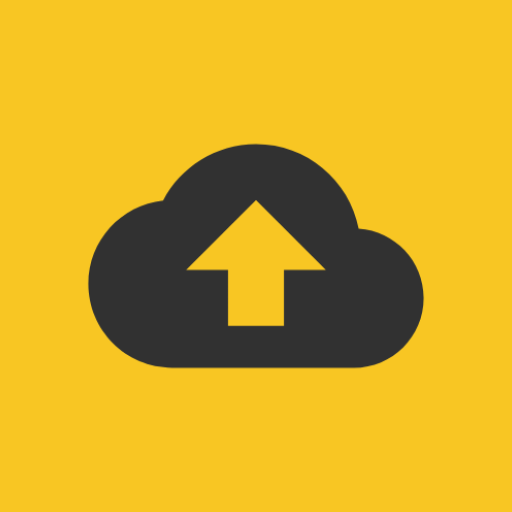
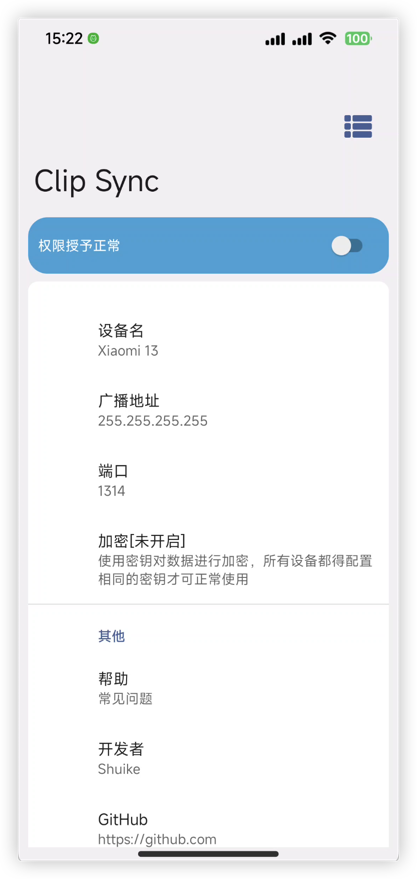
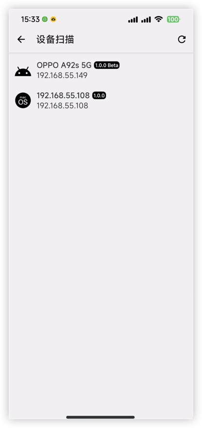

<h1 align="center">ClipSync Android版</h1>

---

  
	 
	 
	

使用ClipSync可将剪切板同步给局域网中其它安装了ClipSync的设备，这些设备可以是Android手机也可以是Mac电脑。

[使用帮助](help.md)

	
  

## 权限说明

- ### android.permission.ACCESS_NETWORK_STATE

	因本软件只能在同一局域网环境下使用，因此需要此权限来获取当前网络可用状态，以保证软件的正常运行。

- ### android.permission.WRITE_EXTERNAL_STORAGE、android.permission.READ_EXTERNAL_STORAGE
	 文件发送功能需要存储权限去读取与写入文件。

- ### android.permission.READ_LOGS与android.permission.SYSTEM_ALERT_WINDOW

	因为Google官方从Android10开始[限制了对剪贴板数据的访问权限](https://developer.android.com/about/versions/10/privacy/changes?hl=zh-cn#clipboard-data)
，因此在Android10及以上平台在后台时需要通过`android.permission.READ_LOGS`与`android.permission.SYSTEM_ALERT_WINDOW`
权限去解决这个限制。

### ClipSync Mac版获取

ClipSync MacOS版本可通过该仓库获取 [ClipSync MacOS](https://github.com/shuike/clipsync_macos)

