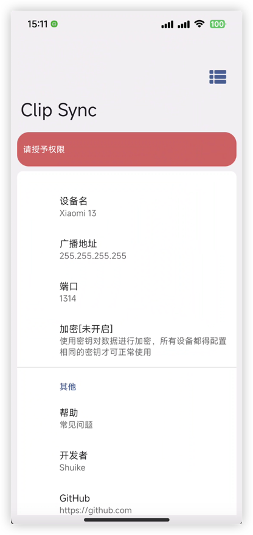
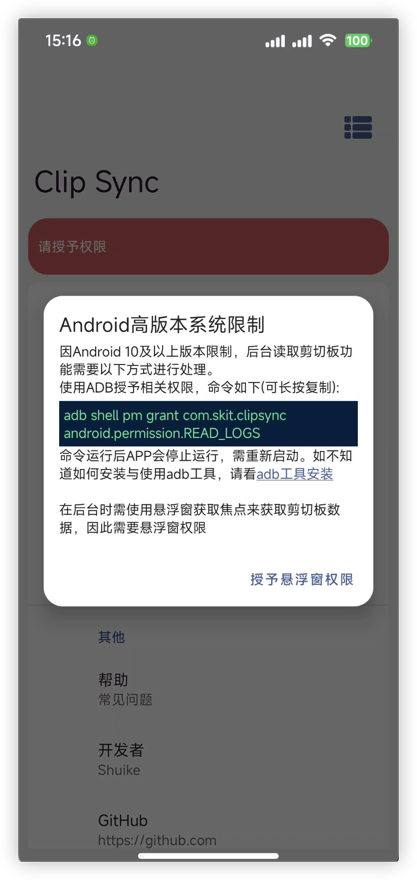
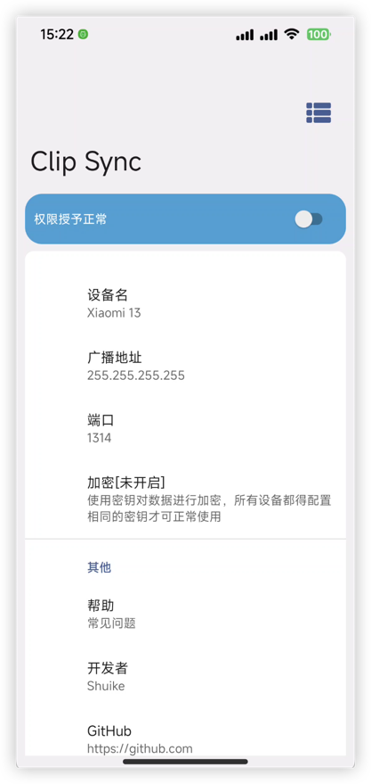
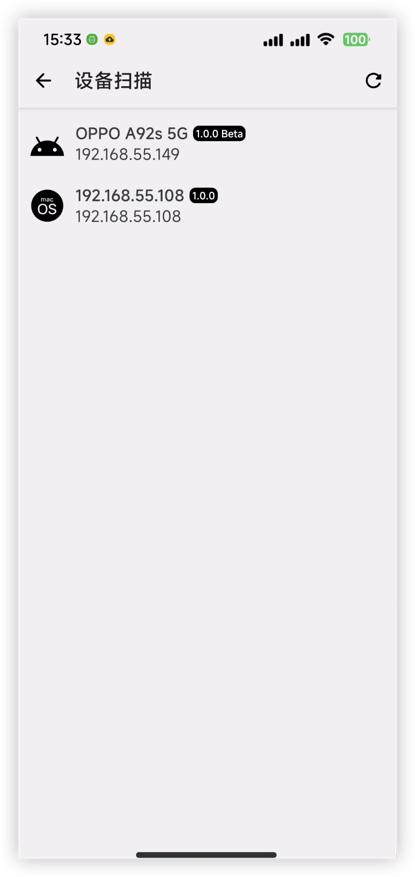
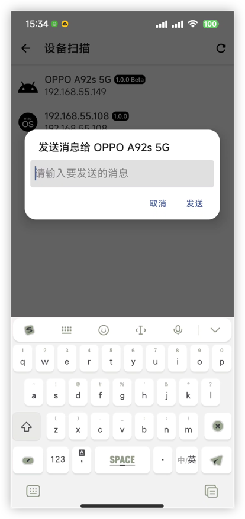
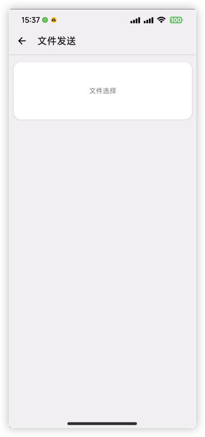
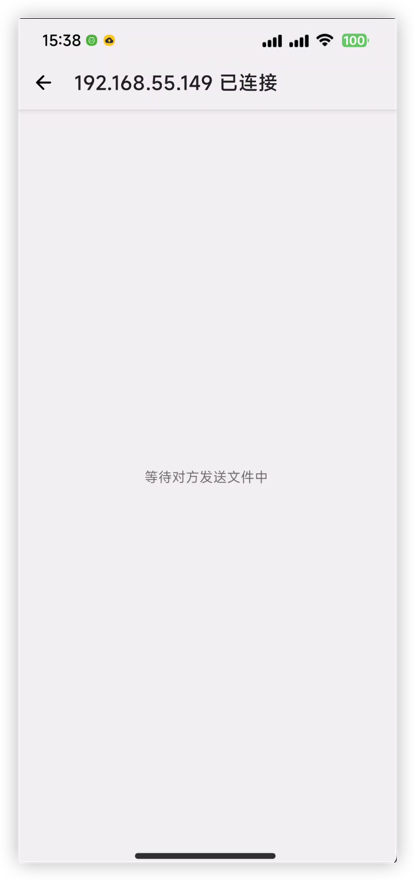

# 使用帮助

## 使用本软件

### 开始

#### 第一步

首先请确认您的Android系统版本，如果您的Android系统版本低于10那么恭喜你，不用做额外的操作，可直接移步至**第二步**。



如果您的Android系统版本等于或高于10那么您在进入软件时会看见如同上面截屏一样的页面，这表明您在首次使用本软件时需进行一些额外的操作，此操作需要您的电脑安装了[ADB工具](https://developer.android.google.cn/studio/command-line/adb?hl=zh-cn)
，如未安装可在[SDK 平台工具版本说明 ](https://developer.android.google.cn/studio/releases/platform-tools?hl=zh-cn)
进行对ADB工具的获取。

在点击红色区域的时候会弹出对话框告诉您具体的操作方法。

图中命令如下:

```shell
adb shell pm grant com.skit.clipsync android.permission.READ_LOGS
```

在使用该命令后应用会退出，需要您手动点击应用图标去启动应用。启动继续点击红色区域，去授予悬浮窗权限(`android.permission.SYSTEM_ALERT_WINDOW`)权限。

#### 第二步

在看到如下图中的页面与开关时，点击开关即可使用本应用。

> 使用时强烈建议自定义`端口号`与开启`加密`，否则在该局域网内可接受该广播的所有设备都可获取您所广播的数据。



### 发送消息给指定设备

在首页点击右上角按钮，进入设备列表，从设备列表点击你需要发送消息的设备，在弹出的对话框输入内容，点击发送即可。如下图所示，发送的消息则会同步到对方设备的剪切板中。



### 文件发送给指定设备

在设备列表长按所需发送文件的设备，在长按后双方设备会进入对应的发送与接收页面，如图所示，在该页面选择与发送文件即可。接收端文件会写入`Download`目录中。



